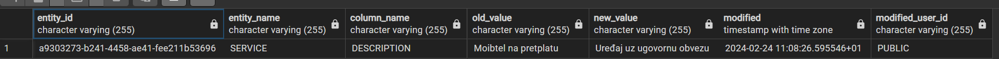

# Sample CRUD App
Simple example of a dockerized Spring Boot / PostgreSQL app

# Prerequisites

1. Docker

## How to start the app
Navigate to the root directory of the project
Run the following commands:

    docker build -t crud-app:1.0.0 .
After the command is completed, run:

    docker-compose up  
To check if the app is started succesfully, make a GET HTTP Request to: `localhost:8080/actuator/health`
You should get the following response:

       {"status":"UP"}
Sample list of requests cane be found in the postman collection located in the 'postman' directory:
*crud-app.postman_collection.json*

# Features
## Advanced filtering and sorting
The filtering is done using the SearchCriteria object consisting of the following fields:

1. Filter key (the field that needs to be filtered)
2. Operation (the search operation)
3. Value (the value used for filtering)
4. Values (the values used for filtering)*
   *Can be used only if the Operation is "IN"

The app also allows searching by the object's child elements even if they are objects themselves.

### Sorting
The app allows sorting of entities. Supported modes are ASC (ascdending) and DESC (descending).
The following parameters cane be appended to the request:

1. sort (the entity field that the sorting should be done)  -  *default is "id"*
2. direction (ASC, DESC)  -* default is DESC*

## Search operations
The app supports 2 search operations:

1. AND **default*
2. OR

Can be provided using the *"searchType"* parameter.
If multiple filters are provided, AND means both filters must be satisfied while OR means at least one filter must be satisfied.

### Examples:
Searches the Service entities by the "description" field.
Operation is "LIKE" which is the same as the SQL LIKE method. The difference is that this ignores capitalization.

    [
	    {
		    "filterKey":  "description",
		    "operation":  "LIKE",
		    "value":  "Tarifa"
	    }
    ]
Searches the Service entities by the "id" field.
Operation is "EQUAL" which means that the entity field values should be exactly the one provided in the "value" field, does not ignore capitalization.

    [
	    {
		    "filterKey":  "id",
		    "operation":  "EQUAL",
		    "value":  "c9bc5ae6-aa55-4efb-82fc-04d3fbad5feb"
	    }
    ]
Searches the Service entities by the "id" field.
Operation is "IN" which supports multiple values, therefore the "values" filed must be populated. The operation is the same as the "IN" operation in SQL.

    [
	    {
		    "filterKey":  "id",
		    "operation":  "IN",
		    "values":  [
		    "a9303273-b241-4458-ae41-fee211b53696",
		    "fdfb46c3-33b7-474c-b6f9-468ddb3dda4d"
		    ]
	    }
    ]

App also supports multiple filters, example:

    [
	    {
		    "filterKey":  "description",
		    "operation":  "LIKE",
		    "value":  "Internet"
	    },
	    {
		    "filterKey":  "id",
		    "operation":  "EQUAL",
		    "value":  "09c64285-a38f-4cde-9fbc-9e01ccbbf891"
	    }
    ]

## I18N
App supports I18N for 2 locales:

1. EN **default*
2. HR

The locale is set using the *Accept-Language* header.

## Automatic Entity auditing
Every edit to entity data is saved in the audit_data table using triggers.
To enable the auditing feature, the entity must extend AuditEntity and have an annotation: `@EntityListeners(AuditListener.class)`

Example: 

## JSON views
JSON Views are used to hide unnecessary data e.g. "created", "modified", etc.. And thus lowering the response size.

## Abstraction for common operations
The app uses abstract controller, service and repository to make code cleaner.
The abstract functionalities include:

1. findAll()
2. findById()
3. findByIds()
4. save()
5. deleteById()
6. findAllPage()

## Custom exception handling
There is a custom ExceptionControllerAdvice class that handled and formats all exceptions made by the app. The response consists of the following fields:

    {
        "statusCode":  400,
        "timestamp":  "2024-02-25T22:34:42.7891728Z",
        "uri":  "/service-providers/non-existing-id",
        "method":  "DELETE",
        "exception":  "EntityNotFoundException",
        "error":  "Entity with ID: a9303273-b241-4458-ae41-fee211b53696 was not found!"
     }

## Logging filters
Every request to app is logged including the request and response data. E.g.:

    --------------------------------------
    REQUEST:
    URI:/service-providers/page
    Method:GET
    Parameters:skip=0&take=10
    Headers:{TRUNCATED}
    Request Body : {TRUNCATED}

    RESPONSE:
    Response Body: {TRUNCATED}
    Response Status:200

    Time taken:12
    --------------------------------------

# Request Examples
The requests containing the examples can be found in `postman/crud-app.postman_collection.json`